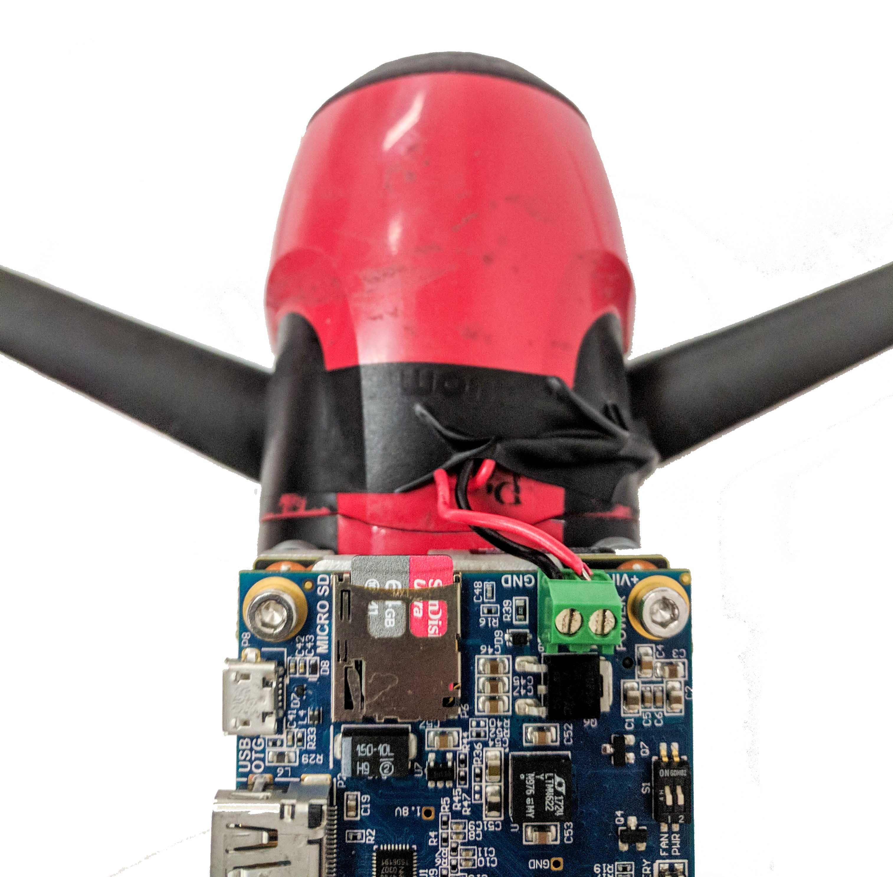
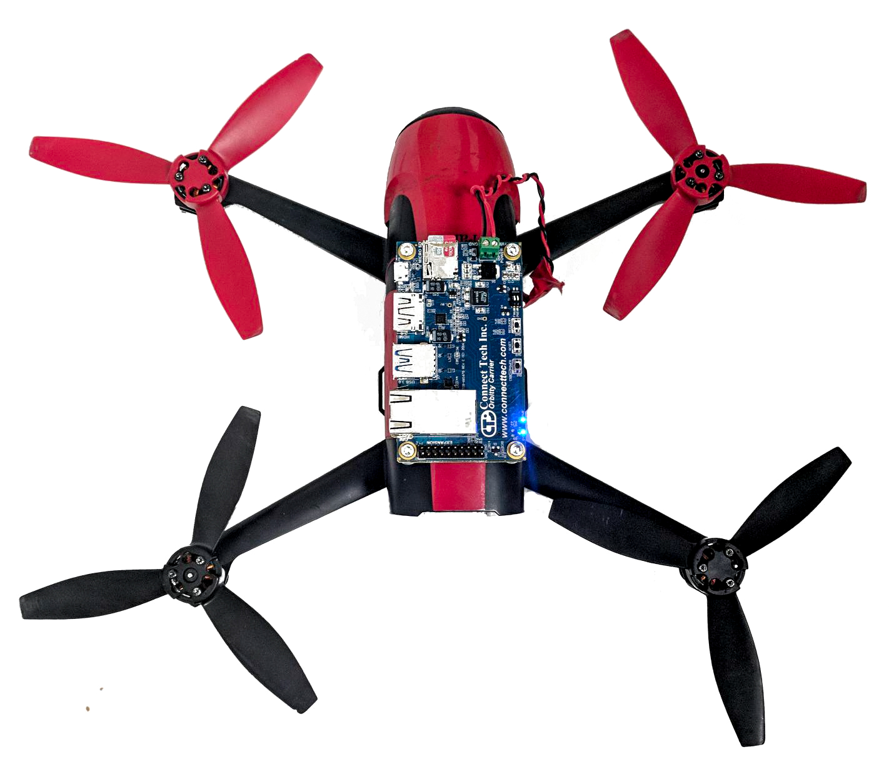

# Mounting NVIDIA Jetson TX2 on Parrot Bebop 2:

### Modify Bebop 2 to get power supply:
```
Disclaimer: You will lose your warranty several times during this operation

Danger: Pay careful attention to following instructions as these modifications can harm you and your device.
```

1. Parrot Bebop 2:


2. Unscrew the two screws holding the nose of the Bebop 2


3. Take out the nose of Bebop 2


4. Unscrew the three screws that holds the GPS+Compass module as shown in figure.


5. Solder two wires at the Positive and the Negative terminal of the board as shown.


6. Make sure the wire is long enough so that it can reach the power inlet port of TX2.


```
Note: Put back GPS (don't forget to clip back the flex) and the nose.
Isolate the end of the wires with duct tape because we need to 
reconnect the battery on the drone temporarily.
```

7. Now, in the **TX2 development board**, first take out the active heat sink/fan power.


8. Unscrew the outer four screws to remove the TX2 from the dev board and inner four screws to remove heat sink.  


9. Removing the heat sink


10. Heat sink and TX2 are separately shown:


11. Connect TX2 to [Orbitty Board](http://connecttech.com/product/orbitty-carrier-for-nvidia-jetson-tx2-tx1/): 


12. Connected module is shown below:

 
 


13. Attach a 3D printed TX2 shield and stick it on the edge (front) of the Bebop 2 Battery.


14. Screw in the TX2+Orbitty board ot the 3D printed shield. <br>
   

15. Do not connect the Bebop 2 battery to the Bebop 2 yet. Make sure the battery sits on the drone but there is no power connection. Connect the positive and the negative terminal from Bebop 2 to the TX2 input terminal. <br>
  

 

16. Tie the loose cable safely to the drone:


17. Now safely turn on the TX2.



18. Turn on Bebop 2 using the standard power button.
 
 

***
